# Vincenzo Di Mauro

## Backend Engineer & Software Architect

Progetto sistemi backend, integrazioni complesse e piattaforme realtime affidabili. 
Dal requisito di business alla produzione: software sicuro, osservabile e mantenibile.

[Portfolio](https://vincodelab.com) · [LinkedIn](https://www.linkedin.com/in/vdmweb/) · [Email](mailto:info@vincodelab.com)

---

<table>
<tr>
<td width="33%" valign="top">
<h3>01 · Backend</h3>

Servizi modulari, API e sistemi distribuiti con confini applicativi chiari.

</td>
<td width="33%" valign="top">
<h3>02 · Integrazioni &amp; realtime</h3>

Provider esterni, code di messaggi, WebSocket e sincronizzazione dei dati.

</td>
<td width="33%" valign="top">
<h3>03 · Produzione</h3>

Resilienza, sicurezza, osservabilità e prestazioni sostenibili.

</td>
</tr>
</table>

## Stack essenziale

<code>Go</code> · <code>TypeScript</code> · <code>Node.js</code> · <code>Python</code> · <code>PostgreSQL</code> · <code>Redis</code> · <code>Docker</code> · <code>Linux</code>

## Dal requisito alla produzione

1. **Progetto** architetture che separano dominio, persistenza, cache e distribuzione realtime.
2. **Integro** API, provider e sistemi legacy in contratti applicativi coerenti.
3. **Rendo operativo** il servizio con deployment ripetibili, logging e monitoraggio.

---

## Attività GitHub pubblica

> **Hai un sistema backend complesso da progettare o evolvere?** 
> Parliamone: [email](mailto:info@vincodelab.com) · [LinkedIn](https://www.linkedin.com/in/vdmweb/)
